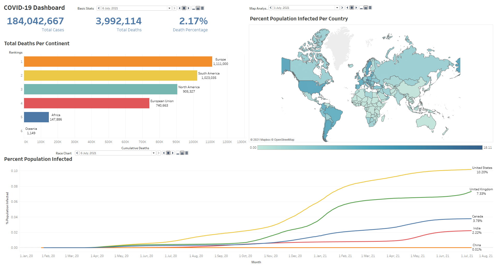
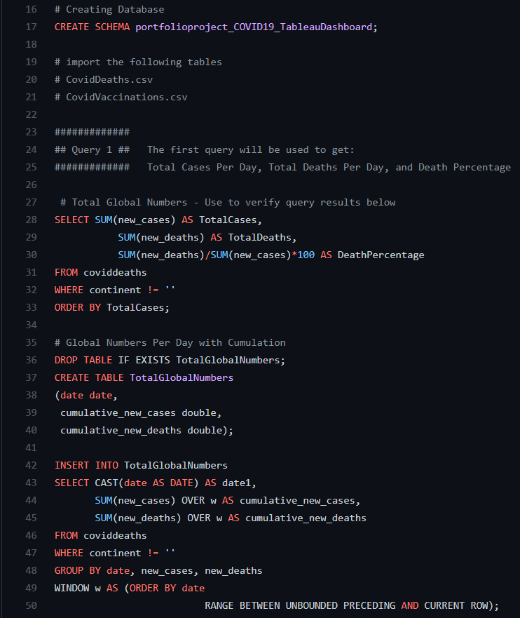

# **COVID-19 Tableau Dashboard**    

# Preface

[Dataset](https://ourworldindata.org/covid-deaths) 

Data pulled on July 6th 2021

This README documents the about the project, skills used, and future plan for development.

# About the Project

[Tableau Public Dashboard](https://public.tableau.com/views/COVID-19Dashboard_16269278155240/COVIDDashboard?:language=en-US&publish=yes&:display_count=n&:origin=viz_share_link)

Note: Due to Tableau Public, you cannot see the animations properly. I suggest to download the [MP4 recording](https://github.com/AspiringDSer/COVID19_Tableau_Dashboard/blob/master/COVID19_Tableau_Dashboard.mp4) (click view raw) or view directly in the Tableau Workbook. 
  
I wanted to use this portfolio piece to showcase some of my Tableau skills. I downloaded a [COVID-19 Dataset](https://ourworldindata.org/covid-deaths) and cleaned the relevant columns using Python. 

I preprocessed the original dataset, `owid-covid-data.csv`, then split it into two csv files:

    Preprocess -> cleaned_owid_covid_data.csv 
    Split -> CovidDeaths.csv + CovidVaccinations.csv 

**Tableau Skills Used:** 
* Animations
* Race Charts
* Calculated Fields
* Map Analysis
* Creating Dashboards

This portfolio piece also demonstrates some of my SQL skills.

[Full List of Queries](https://github.com/AspiringDSer/COVID19_Tableau_Dashboard/blob/master/COVID19_data_for_tableau_dashboard.sql)

**Skills Used:** 
* Creating Tables
* CTE's
* Window Functions 
* Aggregate Functions

## Files:

* images/sql_query_snippet.PNG --- Snippet of SQL Queries

* images/Tableau_Dashboard.PNG --- PNG of Tableau Dashboard

* COVID19_Tableau_Dashboard.twb --- Tableau Workbook 

* COVID19_data_for_tableau_dashboard.sql --- Contain SQL queries used to create tables for the Tableau Workbook 

* COVID19_Tableau_Dashboard.mp4 --- MP4 recording of the dashboard with the animations 

* CovidDeaths.csv --- Data on COVID-19 Deaths

* CovidVaccinations.csv --- Data on COVID-19 Vaccinations                           

* cleaned_owid_covid.csv --- csv output after I cleaned certain columns of the original dataset via Python

* owid-covid-data.csv --- Original Dataset 

* owid_covid_data_preprocessing.ipynb --- Jupyter Notebook 
that explains the data preprocessing on the original dataset via Python

* CHANGELOG&#46;md --- All notable changes to this project will be documented in this file. 

# Future Developments 
* Structuring the all the data to one source - With this, I can click the play button once to activate all the animations. 
* Add an automated pipeline to update the data. 
